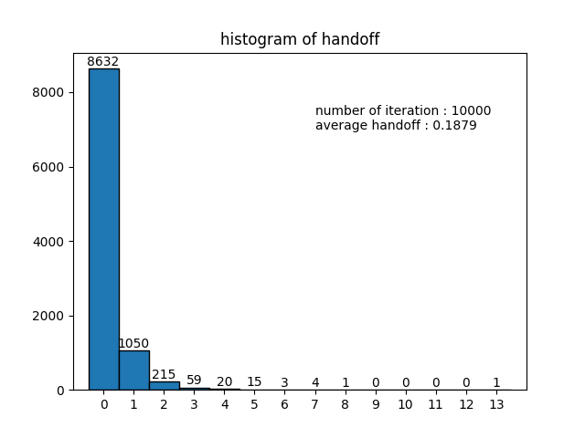

<h2 style="text-align: center"><br><br>Handoff simulation in hexagonal cell environments </h2>

<div style="text-align: center">MCL Intern Assignment 1</div>
<div style="text-align: center">Dohun Kim - 2020.9.6</div>


### 1. 요약

 핸드오프(handoff 또는 handover)란 이동단말이 호를 계속 유지하면서 기지국 간 이동을 원활하게 지원하는 기능이다. 본 시뮬레이션에서는 이동단말이 현재 기지국의 영역에서 인접한 다른 기지국의 영역으로 이동하는 경우만을 핸드오프로 간주하였다. 구현의 단순함을 위해 육각형 셀 환경과 단말의 방향전환사이 등속도 이동을 가정하였다. 이동단말의 호가 발생하여 종료될 때까지 발생한 핸드오프의 과정을 C 언어를 이용해 시뮬레이터를 만들고, 각종 파라미터의 변화에 따른 핸드오프 발생률의 변화를 분석하였다.


### 2. 서론

#### 2-1. 시뮬레이션 내용

1. N(>10000)개의 호를 발생시키고 각 호가 통화 종료시까지 경험하는 핸드오프의 횟수를 구한다.
2. N개의 호의 핸드오프 횟수의 분포를 히스토그램으로 나타낸다.
3. 파라미터(셀의 크기, 이동 속도, 평균 이동 거리, 평균 통화 시간)를 변화시키면서 <br>각각의 경우에 대해 N개의 호의 평균 핸드오프 발생 횟수를 구하여 그래프로 나타낸다.


#### 2-2. 가정

1. 육각형 셀 환경에서 이동단말이 기존의 셀에서 인접한 다른 셀로 이동하면 핸드오프가 1회 발생한다.
2. 통화 시간은 지수 분포를 따른다.
3. 호의 발생 위치는 육각형 셀에 균일하게 분포한다.
4. 방향 전환 시 이동 방향은 $ [0, 2\pi] $ 내에서 균일 분포를 따른다.
5. 방향 전환 사이의 이동 속력은 $ [2\text{km/h}, 6\text{km/h}] $ 내에서 균일 분포를 따른다.
6. 방향 전환 사이는 일정한 속도로 이동한다.
7. 방향 전환 사이의 이동 거리는 지수 분포를 따른다.


#### 2-3. 파라미터 기본 값


||파라미터|기본 값&nbsp;&nbsp;&nbsp;&nbsp;&nbsp;&nbsp;&nbsp;| 시뮬레이션 범위            |                  |
|----|----|----|----|---------|
||셀 크기|$500\text{[m]}$| $[100, 110, \cdots, 1000]$ ||
||평균 통화 시간|$2\text{[min]}$| $[2, 2.1, \cdots, 10]$     ||
||평균 이동 속도|$4\text{[km/h]}$| $[10, 20, \cdots, 1500]$   ||
||평균 이동 거리|$100\text{[m]}$| $[0.1,0.2, \cdots,  20]$   ||


### 3. 본론

#### 3-1. 알고리즘

 이동단말이 육각형 셀로 이루어져있는 2차원 공간에서 이동할 때, 핸드오프가 일어나 단말과 연결된 기지국이 변경되는 과정을 그대로 모사하고자 하였다. 알고리즘을 단계별로 구분하여 탑-다운 방식으로 작성하였다. 전체 시뮬레이션의 기본 수행 단위가 되는 1개의 호에 대한 핸드오프 횟수를 구하는 알고리즘은 다음과 같이 여러 단계로 단순하게 나타낼 수 있다. 


___

**Algorithm 1** simulation - 1개의 호에 대한 시뮬레이션 수행

---

```
1	algorithm simulation
2		initialize position of node with uniform distribution
3		initialize call duration of node with exponential distribution
4	
5	    while call duration > time taken
6  	 	 	move node to next position
7    	end
8    
9  		return handoff count of node
10	end	
```

---

 먼저 이동단말(의사코드 작성의 편의상 node로 표현하였음) 초기 위치와 통화 시간을 초기화한다. 이동단말의 위치는 육각형 셀 내에서 균일 분포를 따르고, 통화 시간은 지수 분포를 따른다. 다음으로 통화 시간이 끝날 때 까지 이동단말의 위치를 이동시키면서 일어나는 핸드오프의 수를 구한다.


___

**Algorithm 2** move_node - 이동단말을 다음 위치로 이동

---

```
1	algorithm move_node
2		generate speed with uniform distribution
3		generate direction with uniform distribution
4		generate distance with exponential distribution
5	
6		distance = min(distance, time left * speed)
7	
8		calculate next position with direction and distance	
9		count number of handoff while moving to next positon
10	end
```

---

 Algorithm 1의 6행에 해당하는 알고리즘이다. 이동 단말을 이동시키기 위해 이동 속력과 이동 방향, 이동 거리를 생성한다. 이동단말의 속력과 방향은 균일 분포를 따르고, 거리는 지수 분포를 따른다. 이때 생성된 이동 거리가 남은 시간동안 갈 수 있는 거리보다 멀다면 거리를 남은 시간동안 갈 수 있는 거리로 변경한다. 다음으로 생성한 거리와 방향을 통해 다음 위치를 계산하고, 이동단말이 다음 위치로 이동하는 동안 발생하는 핸드오프의 횟수를 구한다.


___

**Algorithm 3** count_handoff - 이동단말이 다음 위치로 이동하는 동안의 핸드오프 횟수 계산

---

```
1	algorithm count_handoff
2		while next position is not in current cell
3			choose segment of hexagonal cell that intersects path of node to next position
4			switch base station to adjacent hexagonal cell that shares the segment
5			increase number of handoff by 1
6		end
7	end
```

---

 Algorithm 2의 9행에 해당하는 알고리즘이다. 이동단말이 다음 위치로 이동하는 경로와 교차하는 셀의 선분을 결정하고, 그 선분을 공유하고 있는 인접한 육각형 셀로 기지국을 변경한다. 이때 핸드오프가 발생하는 것이므로 핸드오프 횟수를 1 증가시킨다. 이동단말의 다음 위치가 현재 셀 내부에 포함될 때까지 이 과정을 반복한다.


___

**Algorithm 4** choose_segment - 이동단말의 경로와 교차하는 셀의 선분 결정

---

```
1	algorithm choose_segment
2		for all segment on hexagonal cell
3			if segment was chosen in previous step
4	 			continue
5	 		end
6		
7	 		if segment intersects path of node to next position
8	 			return segment
9	        end
10		end
11	end
```

---

 Algorithm 3의 3행에 해당하는 알고리즘이다. 육각형 셀의 모든 선분에 대해 단말의 이동경로와 교차하는지 확인한다. 이때 첫번째 핸드오프가 일어난 이후의 셀에서는 단말의 이동경로와 육각형 셀 선분의 교차가 두번 발생할 수 있다. 둘 중 하나는 이전 차례에 현재 셀로 단말을 넘겨준 셀과 공유하는 선분이며, 다른 하나는 다음 차례에 현재 셀이 단말을 넘겨줄 셀과 공유하는 선분이다. 따라서 선분을 결정할 때, 전자를 무시하고 후자를 택한다.


___

**Algorithm 5** shift_node - 선택된 선분을 공유하는 셀로 기지국을 변경

---

```
1	algorithm shift_node
2		(x1, y1), (x2, y2) = both ends of the chosen segment
3		(dx, dy) = (x1, y1) + (x2, y2)
4		current position = current position - (dx, dy)
5		next position = next position - (dx, dy)
6	end
```

---

 Algorithm 3의 4행에 해당하는 알고리즘이다. 기지국이 변경된다는 것은 2차원 좌표계의 원점이 다음 셀의 중심으로 재정의된다는 것과 같다. 따라서 원점 즉 현재 기지국의 위치를 기준으로 한 다음 기지국의 위치를 구하고, 이동노드의 현재 위치와 다음 위치에 다음 기지국의 위치를 빼면, 이동노드의 위치가 평행이동하여 원점이 다음 기지국으로 이동한 것과 같게 된다. 다음 기지국의 위치는 선택된 선분의 양 끝 점의 좌표를 더하여 구할 수 있다.


#### 3-2. 결과

##### 3-2-1. 10000개의 호의 핸드오프 횟수 분포




##### 3-2-2. 파라미터의 변화에 따른 평균 핸드오프 횟수


 직관적으로 생각했을 때, 셀의 크기가 커지면 핸드오프가 덜 일어날 것이고, 이동단말의 속력과 이동 거리, 통화 시간이 커지면 핸드오프가 더 많이 일어날 것이라고 추측할 수 있다. 실제로, 위의 시뮬레이션 결과로부터 평균 핸드오프 횟수와 셀의 크기는 반비례 관계, 평균 속력과 평균 통화시간은 비례 관계를 가진다는 것을 확인할 수 있다. 


 한편, 평균 거리와 평균 핸드오프 횟수의 관계는 예상치 못한 결과를 얻었다. 평균 거리가 어떤 값 이상이 되면, 평균 거리를 아무리 늘려도 평균 핸드오프 수가 거의 변하지 않고 0.19 부근에 머물러 있는 그래프가 그려진다. 이 원인은 평균 거리 파라미터 값을 늘린다하더라도, 실제로 생성되는 거리의 값에는 제한이 있기 때문이다. Algorithm 2 의 4번행과 6번행을 보자.

___

```
4		generate distance with exponential distribution
5	
6		distance = min(distance, time left * speed)
```

---

 4번행에서 생성되는 거리의 값의 평균값은 파라미터 값을 따를 것이다. 하지만 6번행에서 앞서 생성된 값과 앞으로 남은 시간 동안 갈 수 있는 거리를 비교해 이동 거리의 값을 바꾸기 때문에, 일정 값 이상에서는 결과적으로 이동 거리의 평균값은 파라미터 값을 따르지 않는다. 아래의 그래프는 파라미터 값과 실제로 생성되는 이동 거리의 평균값의 관계를 나타낸 것이다.


### 4. 결론
